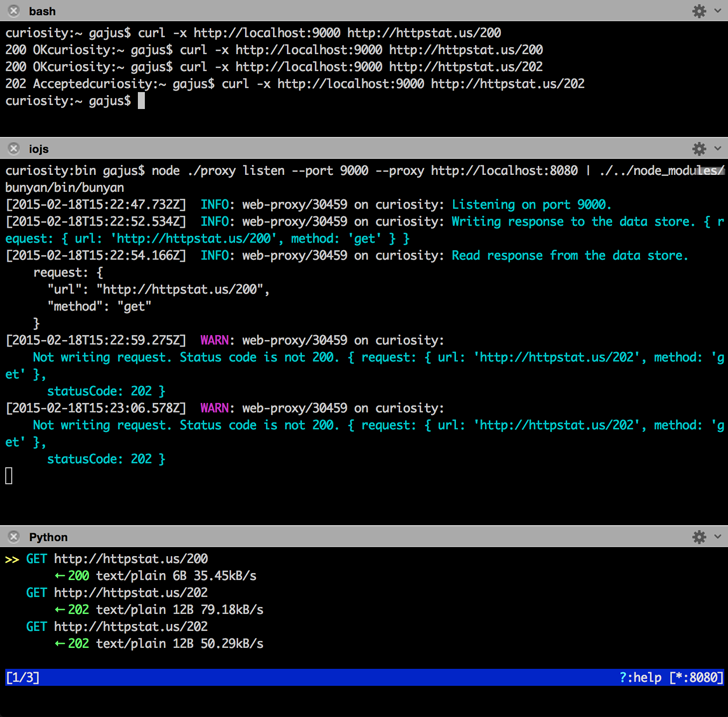

# Web Proxy

[](https://travis-ci.org/gajus/web-proxy)
[](https://www.npmjs.org/package/web-proxy)

Web Proxy (forward proxy) for intercepting and selectively caching HTTP requests.

## Use Case

web-proxy has been designed to selectively cache outgoing HTTP requests for logging and re-iteration purposes, e.g. if you are running an inefficient web scrapping service or wish to re-run scrapping service using earlier fetched pages.

## Demo



Illustration demonstrates cURL requests being made using web-proxy.

web-proxy is configured to:

* cache all HTTP GET requests that result in 200 response.
* to forward all resulting HTTP requests to further proxy ([mitmproxy](https://mitmproxy.org/)).

## Command Line Usage

```sh
node ./bin/proxy --help
```

### MySQL

Web Proxy can be used with a persistent data store. The only backend supported at the moment is MySQL.

To enable use of the MySQL backend, provide connections credentials at the time of starting the proxy.

Database schema can be obtained from `./database/proxy.sql`. Note that table is using `ROW_FORMAT=COMPRESSED`. In order to benefit from the compression, ensure that the following MySQL variables are set:

```ini
innodb_file_format=BARRACUDA
innodb_file_per_table=ON
```

For more information, refer to http://stackoverflow.com/a/13636565/368691.

### Proxy

Web Proxy can forward all outgoing HTTP requests to another proxy.

To enable forwarding, provide proxy credentials at the time of starting the proxy.

```sh
node ./bin/proxy --help
```

## API

WebProxy can be used programmatically.

```js
var WebProxy = require('../src/webproxy'),
    config = {},
    server;

/**
 * @param {Object} reference
 * @param {String} reference.method
 * @param {String} reference.url
 * @return {Null} Returning null will allow HTTP request to progress.
 * @return {Object} response
 * @return {Number} response.statusCode
 * @return {Object} response.headers
 * @return {String} response.body
 */
config.read = function (request) {
    //
};

/**
 * @param {Object} reference
 * @param {String} reference.method
 * @param {String} reference.url
 * @param {Object} response
 * @param {Number} response.statusCode
 * @param {Object} response.headers
 * @param {String} response.body
 */
config.write = function (request, response) {
    //
};

/**
 * @param {Object} config
 * @param {Function} config.read
 * @param {Function} config.write
 * @param {Object} config.logger
 */
server = WebProxy(config);

server.listen(9000);
```

### Data Store

Data can be read/written using custom logic.

There are two existing data store interfaces:

| Name | Description |
| --- | --- |
| `DataStore.session` | Session persits data in an object for the duration of the script runtime. |
| `DataStore.database` | Data is read/written to/from a MySQL database. |

Refer to the [`./bin/proxy.js`](./bin/proxy.js) implementation to see a working example.
